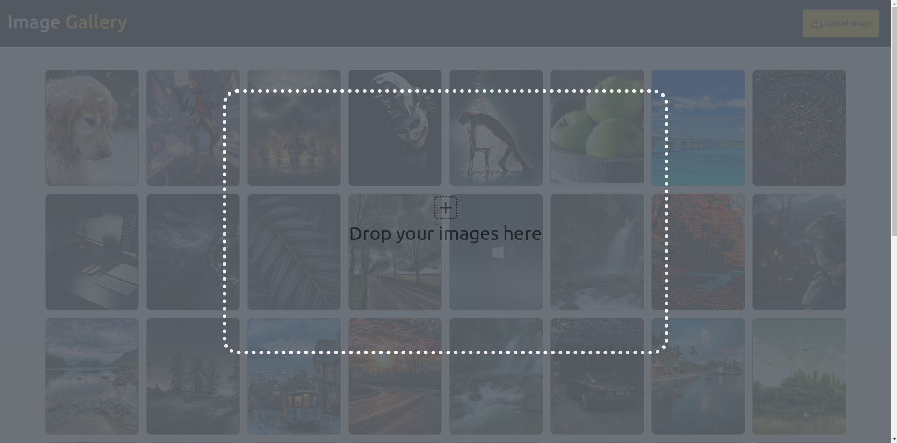

# Wallpaper Gallery

This is a web application where users can upload and download images.





## Technologies Used

- Backend:
    - Spring Framework
    - Java 11
    - Java SE Library
    - CORS Filters

- Frontend:
    - HTML5
    - CSS3
    - SCSS
    - ECMAScript
    - Bootstrap
    - Animate.CSS
    - CSS Loaders
    - FileSaver.js
    - jQuery
    - jQuery AJAX
    - Parcel (Build Tool)

## Features

- Image Upload: Users can upload their own images to the gallery.
- Image Download: Users can download images from the gallery.

## How to get this project

1. Clone the repository:

   ```bash
   git clone https://github.com/Vishwa-Dinath/image-gallery.git
